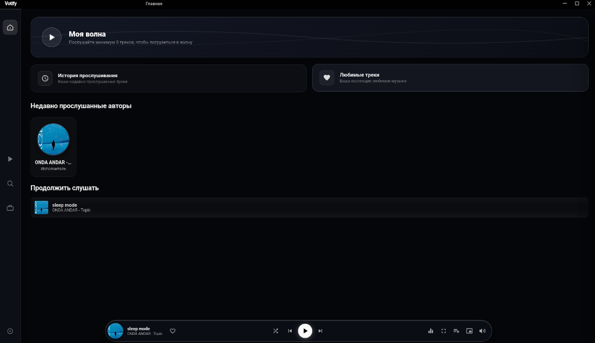
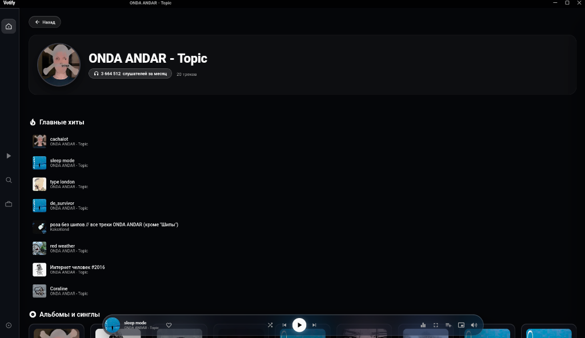
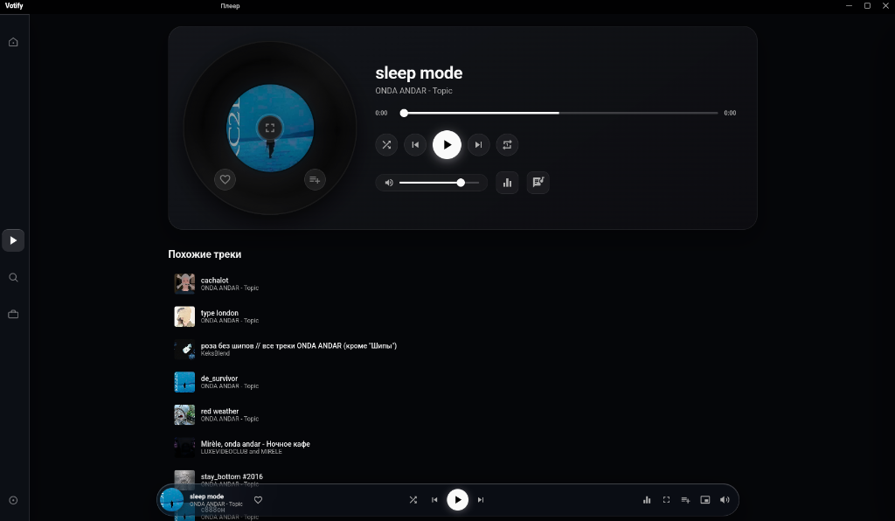
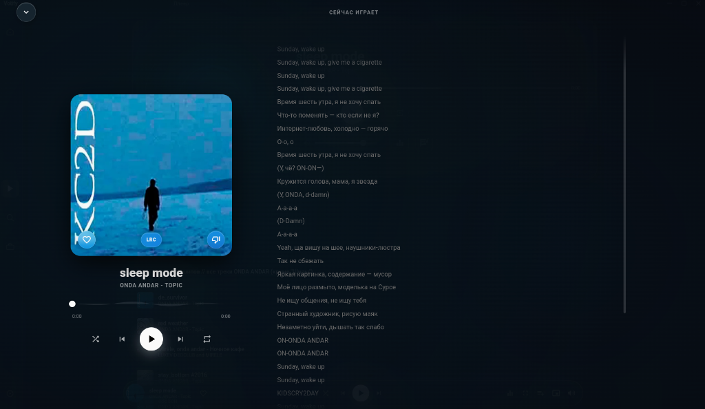
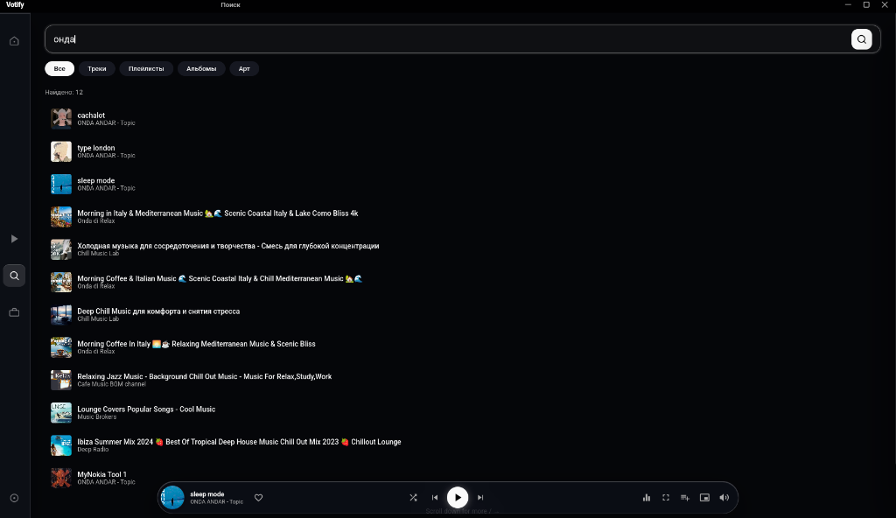
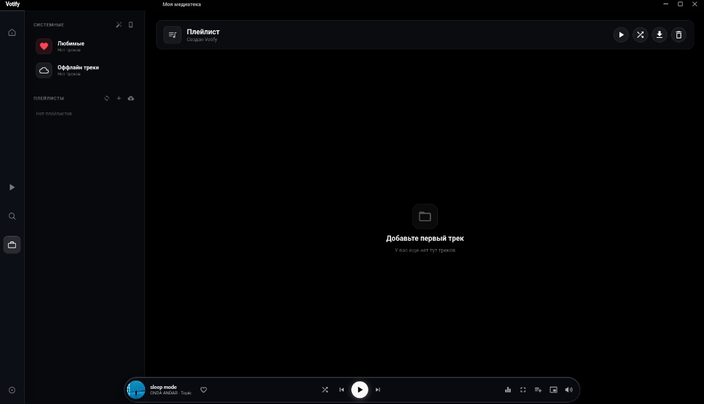
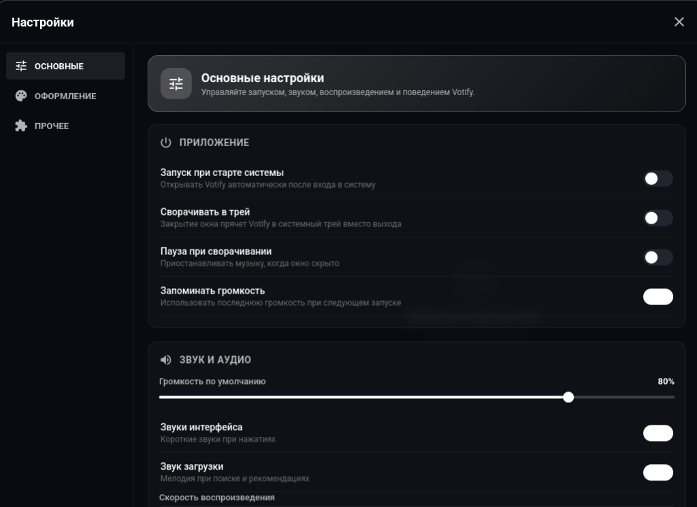
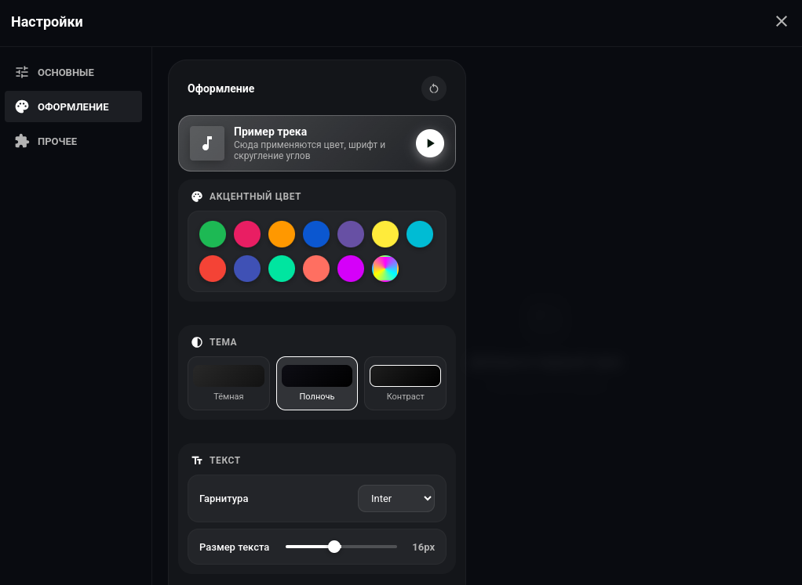

## 📸 Скриншоты интерфейса

### 🏠 1. Главная страница


### 🎵 2. Страница исполнителя


### 📻 3. Плеер и рекомендации


### 🌌 4. Полноэкранный плеер с текстом песен


### 🔍 5. Поиск с пагинацией


### 📚 6. Медиатека (Master-Detail)


### ⚙️ 7. Настройки — Основные (MP3 треки)


### 🎨 8. Настройки — Оформление


---

## 📦 Сборка и запуск

### Требования
- Node.js (v20+)
- npm

### Установка зависимостей
```bash
npm install
```

### Запуск в режиме разработки
```bash
npm start
```

### Discord Rich Presence

Application ID Votify уже встроен в приложение, поэтому дополнительная настройка переменных окружения не требуется. Запустите Discord Desktop, затем Votify:

```bash
npm install
npm start
```

Votify показывает в Discord название трека, исполнителя, обложку и таймлайн воспроизведения. На паузе таймлайн скрывается, чтобы он не продолжал идти; после возобновления или перемотки он автоматически синхронизируется.

При необходимости встроенный Application ID можно переопределить:

```bash
VOTIFY_DISCORD_CLIENT_ID=другой_application_id npm start
```

Для локальных треков без публичной обложки можно дополнительно указать ключ изображения, загруженного в Rich Presence Art Assets:

```bash
VOTIFY_DISCORD_LARGE_IMAGE_KEY=votify npm start
```

### Firebase: аккаунты и синхронизация

Votify поддерживает регистрацию по email, гостевой вход, профили, аватары и облачную синхронизацию настроек, плейлистов и истории через Firebase Authentication и Firestore.

1. Включите Email/Password и Anonymous в Firebase Authentication.
2. Создайте Firestore и опубликуйте правила из `firestore.rules`.
3. Создайте Web App в Firebase.
4. Сохраните публичную Web-конфигурацию в `firebase-config.json` в корне проекта.

```json
{
  "apiKey": "...",
  "authDomain": "project.firebaseapp.com",
  "projectId": "project",
  "storageBucket": "project.firebasestorage.app",
  "messagingSenderId": "...",
  "appId": "..."
}
```

`firebase-config.json` не попадает в Git. Для CI и сборки релиза ту же конфигурацию можно передать в `VOTIFY_FIREBASE_CONFIG` одной JSON-строкой. Service Account и Admin SDK приложению не нужны.

#### Вход через Google в Electron

Google не разрешает авторизацию во встроенном окне Electron, поэтому Votify открывает системный браузер и принимает результат через временный локальный адрес `127.0.0.1`. В Google Cloud Console этого же Firebase-проекта создайте **OAuth client ID → Desktop app** и скачайте JSON. Импортируйте его без вывода значений в терминал:

```bash
npm run configure:google -- ~/Downloads/client_secret_....json
```

Команда проверяет тип клиента и Firebase Project ID, добавляет значения в игнорируемый `firebase-config.json` и выставляет права `0600`. То же самое можно сделать вручную:

```json
{
  "apiKey": "...",
  "authDomain": "project.firebaseapp.com",
  "projectId": "project",
  "appId": "...",
  "googleDesktopClientId": "123456789-example.apps.googleusercontent.com",
  "googleDesktopClientSecret": "GOCSPX-..."
}
```

Эти поля добавляются к существующей Web Config, а не заменяют её. OAuth secret приложения типа Desktop не считается конфиденциальным серверным ключом, однако Service Account JSON по-прежнему нельзя помещать в приложение. Если Firebase покажет настройку разрешённых OAuth Client IDs у провайдера Google, добавьте туда созданный Desktop Client ID.

При первом запуске без сохранённой сессии Votify автоматически открывает экран создания аккаунта. Пользователь может зарегистрироваться по email, войти через системный браузер Google или продолжить как гость.

#### Мастерская тем

Встроенная мастерская хранит публичные темы в `workshopThemes/{themeId}`. Просматривать, искать и устанавливать темы можно без аккаунта; публиковать и удалять собственные темы могут только постоянные Email/Google-аккаунты. Гостевые аккаунты перед публикацией нужно привязать.

После обновления приложения обязательно повторно опубликуйте `firestore.rules` в Firebase Console. Правила разрешают только безопасный набор цветов и параметров, а также HTTPS-ссылку на фон длиной до 2048 символов; запрещают изменение публикаций и позволяют удаление только владельцу. Локальные изображения, HTTP-ссылки и произвольный CSS в мастерскую не загружаются.

Правила также можно опубликовать через Firebase CLI (при первом использовании откроется вход Google):

```bash
npx firebase-tools@15.26.0 login
npm run deploy:firestore-rules
```

### Сборка релизных дистрибутивов (Linux AppImage & deb)

```bash
# Сборка AppImage & deb (Linux)
npx electron-builder --linux AppImage deb

# Сборка .exe (Windows)
npm run build:win
```

Собраные файлы будут находиться в папке `dist/`.

---

## 📄 Лицензия
MIT License © 2026 Votify Team
