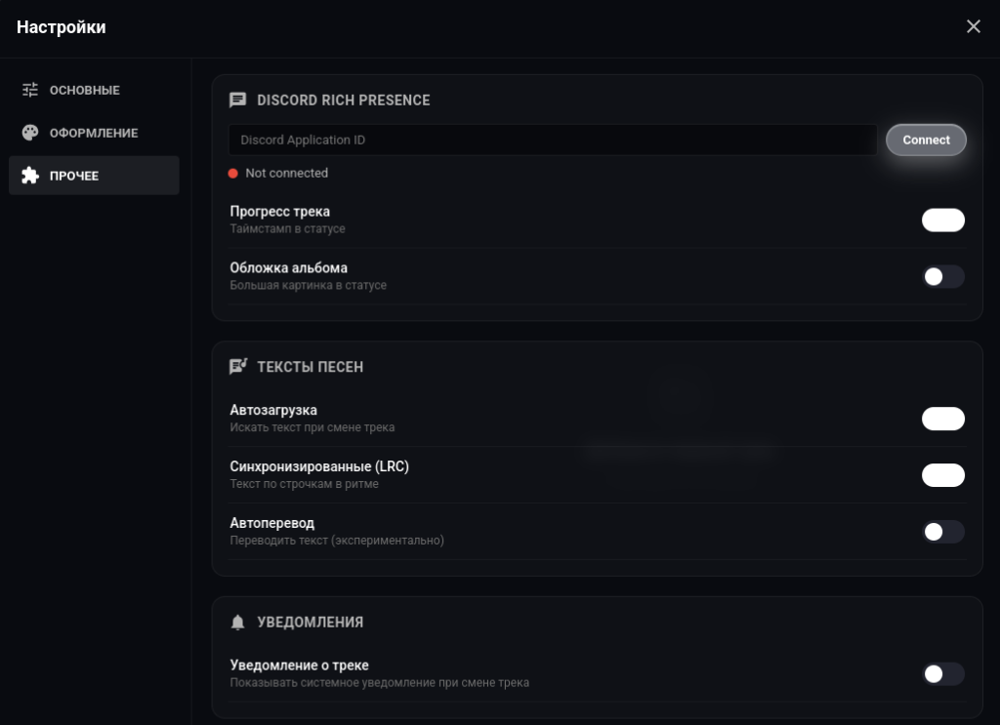

# 🎵 Votify v0.5.0

> Современный, быстрый и стильный десктопный плеер с дизайном Liquid Glass (iOS style), поддержкой оффлайн-музыки, синхронизированных текстов песен и темной темой.

---

## 🌟 Основные особенности v0.5.0

- 🧪 **Liquid Glass (iOS Style)** — опциональный размытый полупрозрачный интерфейс в стиле матового стекла (backdrop-filter blur).
- 🗂️ **Новая двухпанельная медиатека (Master-Detail)** — удобная навигация по плейлистам, оффлайн-трекам и избранному.
- 🎛️ **Компактная боковая панель (Rail Sidebar)** — утонченные иконки быстрых переходов (Главная, Плеер, Поиск, Медиатека, Настройки).
- 🌊 **Укрупненный баннер «Моя волна»** — умный поток персональных рекомендаций с новым визуальным дизайном.
- 🎤 **Синхронизированные тексты песен (LRC)** — караоке-режим со встроенным текстом песен и полноэкранным плеером.
- 🎨 **Полная кастомизация оформления** — акцентные цвета, темы («Тёмная», «Полночь», «Контраст»), гарнитура шрифтов.
- 🎧 **Экстра-функции аудио** — кастомный эквалайзер, оффлайн-режим, умный поиск и авторы.

---

## 📸 Скриншоты интерфейса

### 🏠 1. Главная страница


### 🎵 2. Страница исполнителя


### 📻 3. Плеер и рекомендации


### 🌌 4. Полноэкранный плеер с текстом песен


### 🔍 5. Поиск


### 📚 6. Медиатека (Master-Detail)


### ⚙️ 7. Настройки — Основные


### 🎨 8. Настройки — Оформление


### 🧩 9. Настройки — Прочее (Discord RPC / Тексты)


---

## 📦 Сборка и запуск

### Требования
- Node.js (v18+)
- npm

### Установка зависимостей
```bash
npm install
```

### Запуск в режиме разработки
```bash
npm start
```

### Сборка релизных дистрибутивов (Linux AppImage & Windows .exe)

```bash
# Сборка AppImage (Linux)
npm run build:appimage

# Сборка .exe (Windows)
npm run build:win

# Полная сборка всех дистрибутивов
npm run build
```

Собраные файлы будут находиться в папке `dist/`.

---

## 📄 Лицензия
MIT License © 2026 Votify Team
